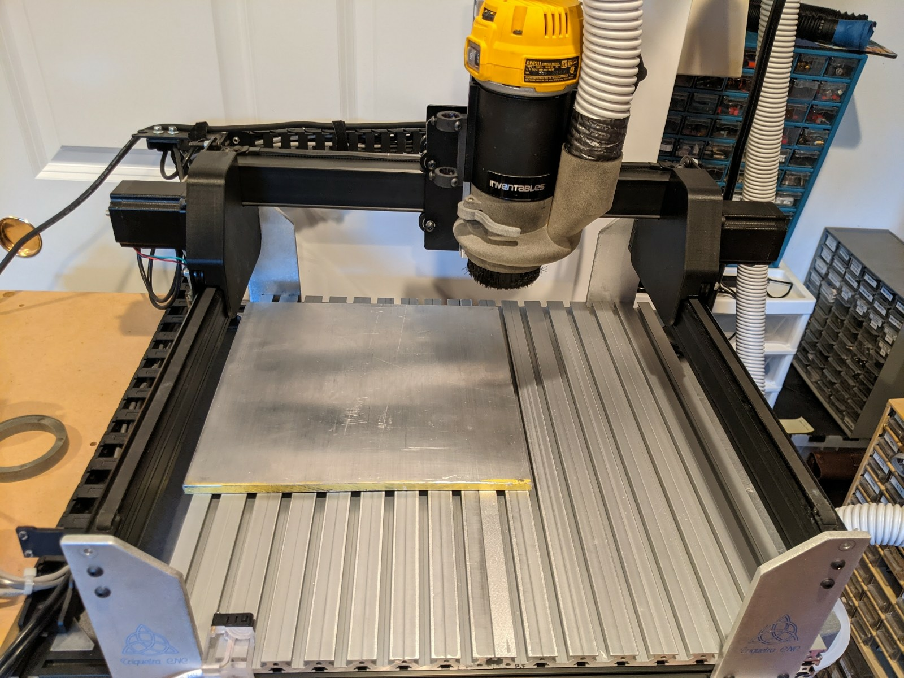
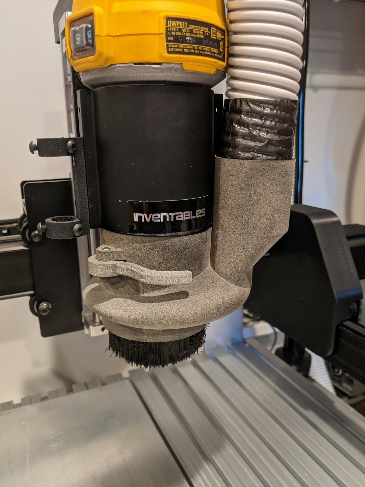

# X-Carve
X-Carve-based three axis CNC milling machine

*TBD*

## GRBL Modifications

*TBD*

## 3D Models

### Dust Shoe for DWP611

*TBD*

### Magnet Mounts for Hall-Effect Switches

*TBD*

### Y-Axis Pulley Covers

*TBD*

### Z-Axis Pulley Cover

*TBD*

### Pen/Microscope Holder

*TBD*

## Related Projects

### [CNC Pendant](https://github.com/jduanen/cnc_pendant)
Connect an XHC WHB04B pendant to a GRBL-based CNC controller using a RaspberryPi Zero

### [Belt Tension Meter](https://github.com/jduanen/Belt-Tension-Meter)
Tool for measuring G2 belt tension for Shapoko-/X-Carve-like CNC machines.

## Modifications

### Z-Axis

*TBD*

### Z-Axis Pulley Cover

*TBD*

### Y-Axis Rail Lifters

*TBD*

### Hall-Effect Limit Switches

*TBD*

### Magnet Mounts for Hall-Effect Switches

*TBD*

### Hall-Effect Z-Axis Probe Sensor

*TBD*

### NEMA-?? Motors

*TBD*

### Spindle AC Controller

*TBD*

### LCD Strip Motor Temperature Sensors

*TBD*

### Extruded Aluminium T-Slot Base Plate

*TBD*

### Switched Central Vacuum with Dust Collector

*TBD*

### Mirrored Acrylic Side Shields

*TBD*

### Y-Axis Pulley Covers

*TBD*

### Pen/Microscope Holder

*TBD*

### Dust Shoe for DWP611

*TBD*
